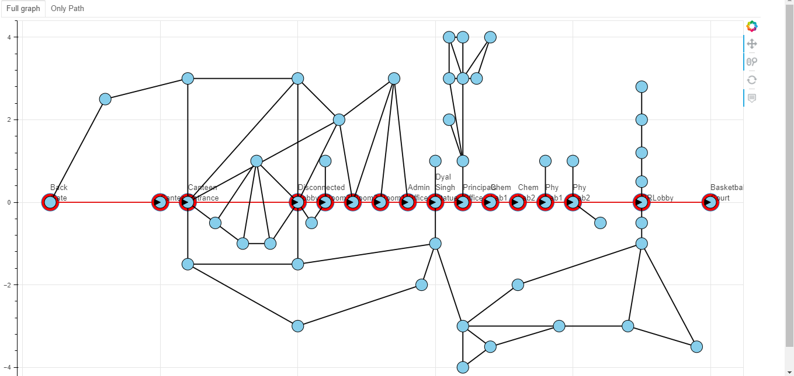

An interactive map of Dyal Singh College, UoD, to help users navigate within the campus area made using python.

Map showing most optimal path from BackGate to MensWashroom3.

Interactive map using Boken python library.

Map showing most optimal path from BackGate to Room1004 and an alternative path for the same.
